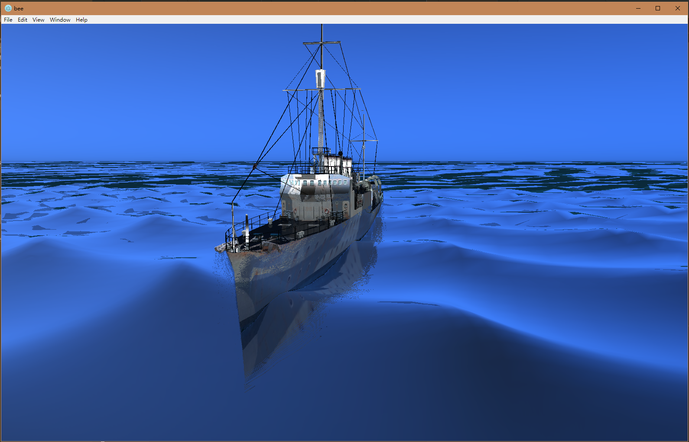
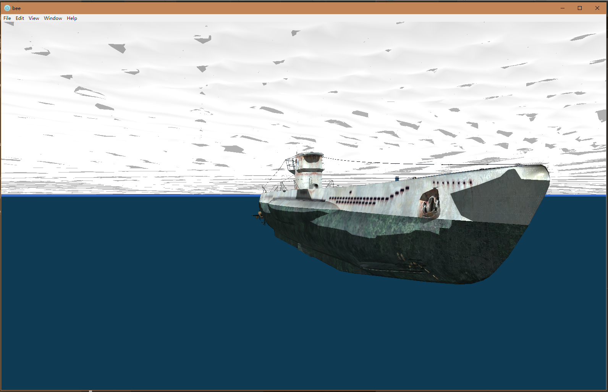

# Bee

Koishi chan likes bee. \>w<

# Img

## NDD Clemson 1

## NDD Clemson 2

## U-Boat 7C

# TODOs

- [X] Typescript
- [X] Election
- [ ] Capability Mode
- [X] Basic WebGL Encapsulation
> - [X] Flexible WebGL Encapsulation
- [X] JSON Model Import
- [ ] OBJ Model Import
- [X] Materials
> - [ ] Enhanced
- [X] Shadow Mapping
- [X] PCF
- [X] Phong Lighting
- [X] Refraction
- [ ] Fresnel Blending
- [X] Postprocess
- [X] Gauss Blur
- [X] Depth & Normal Texture
- [ ] Noise
- [X] Skybox
- [X] Dynamic Ambient Cube
> - [ ] Figure out a better Skycolor Function 
- [X] Depth Based Raymarching
> - [ ] Increase Precision
- [X] SSR
> - [ ] Reduce Noise
- [X] Ocean Terrain LOD
- [X] Gerstner Waves
- [ ] FFT Waves
- [ ] AABB
- [ ] Dynamics
- [ ] Transform Feedback

- [X] 60 FPS