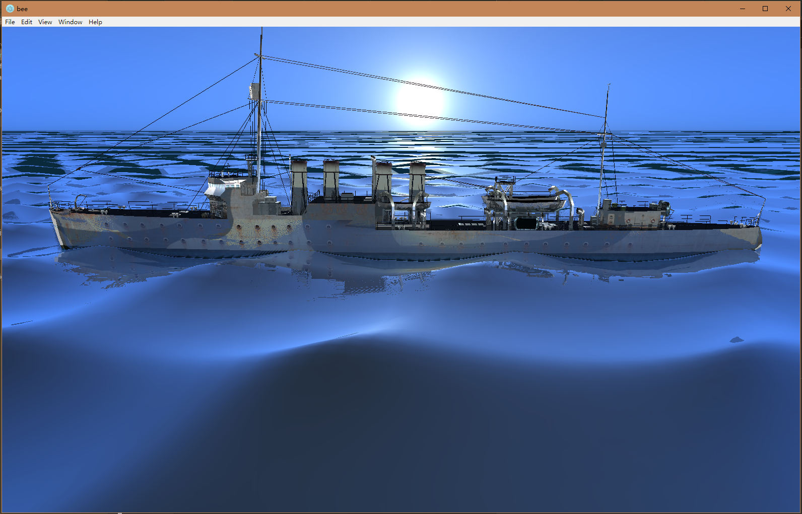
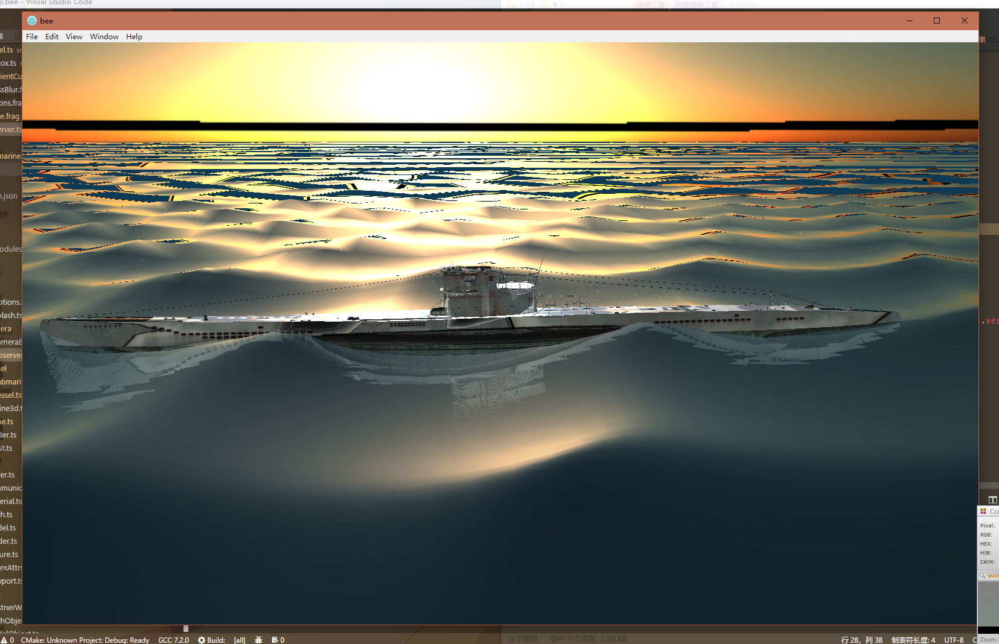
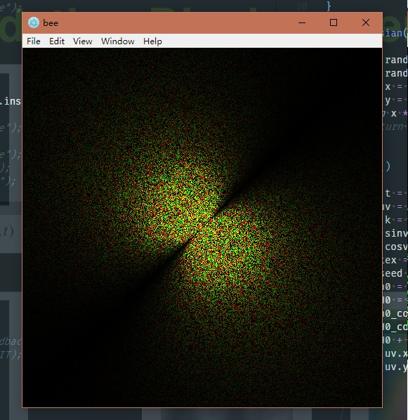
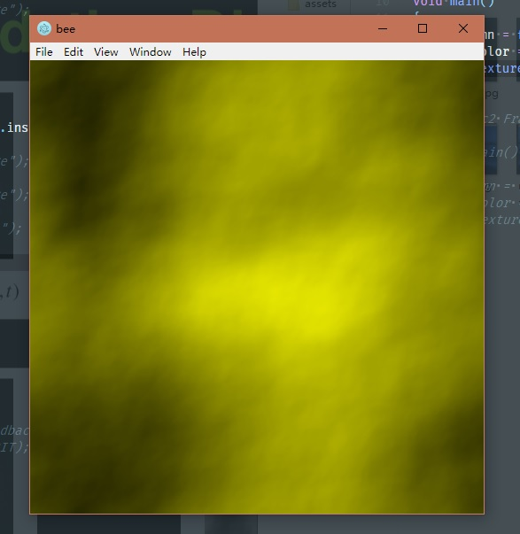
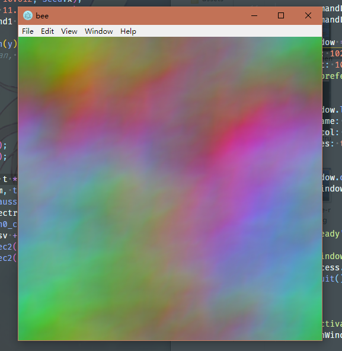
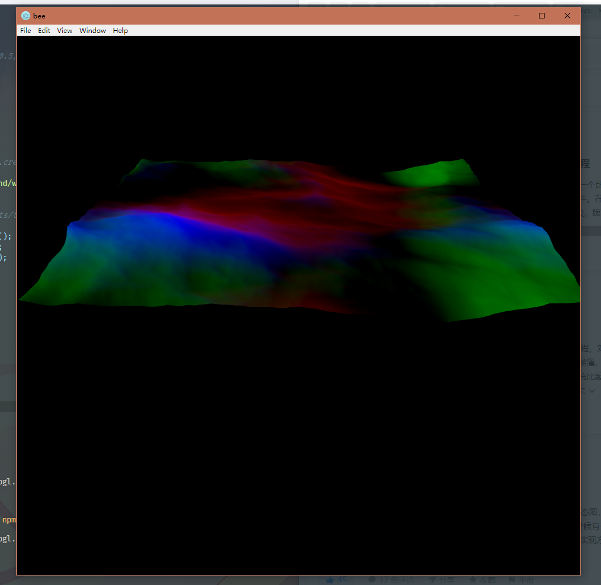
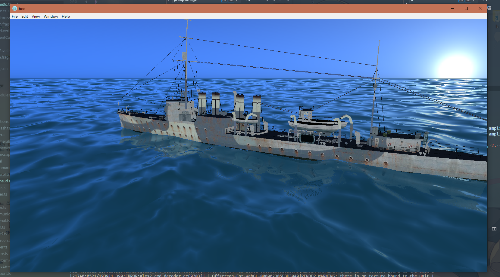

# Bee

Koishi chan likes bee. \>w<

# Img

## NDD Clemson

## new filter function && ambient

## Phillips Spectrum

## Height Field

## Displacement Map

## FFT Wave

# TODOs

- [X] Typescript
- [X] Election
- [ ] Capability Mode
- [X] Basic WebGL Encapsulation
> - [X] Flexible WebGL Encapsulation
- [X] JSON Model Import
- [ ] OBJ Model Import
- [X] Materials
> - [ ] Enhanced
- [X] Shadow Mapping
- [X] PCF
- [X] Phong Lighting
- [X] Refraction
- [X] Fresnel Blending
- [X] Postprocess
- [X] Gauss Blur
- [X] Depth & Normal Texture
- [X] Perlin Noise
- [X] Skybox
- [X] Dynamic Ambient Cube
> - [ ] Figure out a better Skycolor Function 
- [X] Depth Based Raymarching
> - [X] Filter function
> - [X] Increase Precision
- [X] Transform Feedback
> - [ ] Transform Feedback Usage
- [X] Floating Point Textures
- [X] Multiple Render Targets - MRT

- [X] SSR
> - [ ] Reduce Noise
> - [ ] Edge Blurring
- [X] Ocean Terrain LOD
- [X] Gerstner Waves
- [X] GPU FFT
> - [X] FFT Waves
> - [ ] Optimize
> - [ ] Normals
- [ ] AABB
- [ ] Dynamics
- [ ] Beautiful Splash Screens \>w<
- [ ] Periscope Blurring
- [ ] Torpedo / Vessel Tracks
- [ ] Bow Wave
- [ ] Froth of Jacobi Determinant
- [ ] Seabed
- [ ] Caustics!!!

- [X] 60 FPS